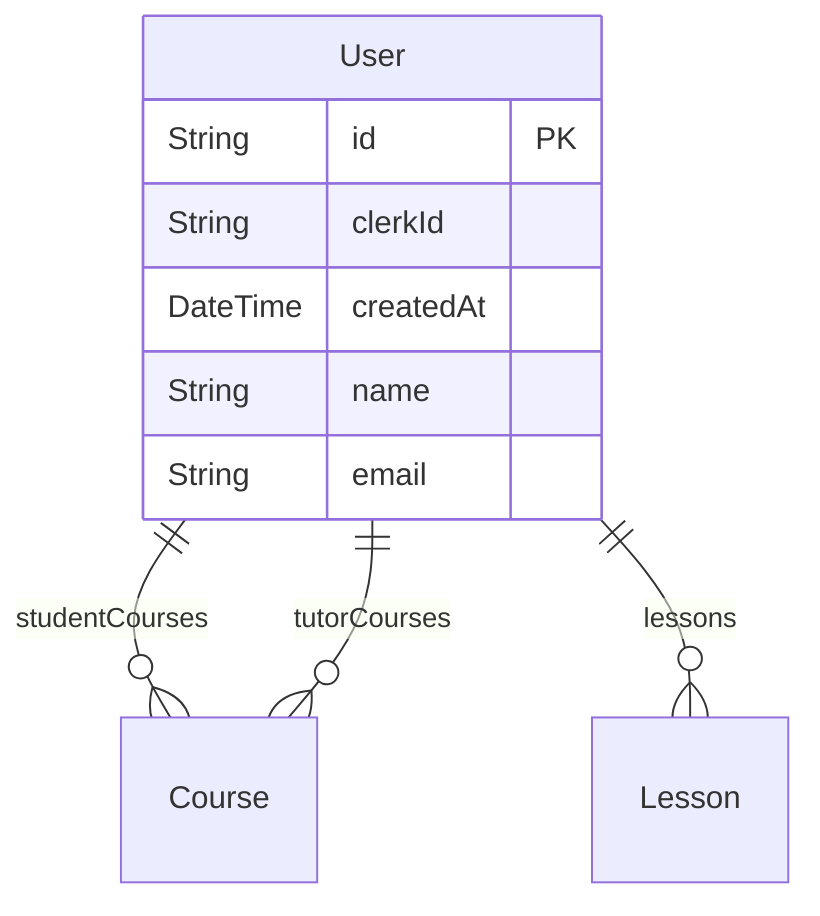
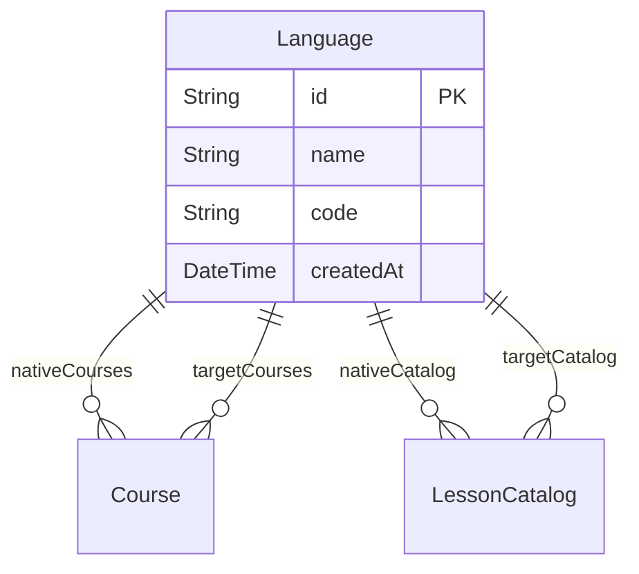
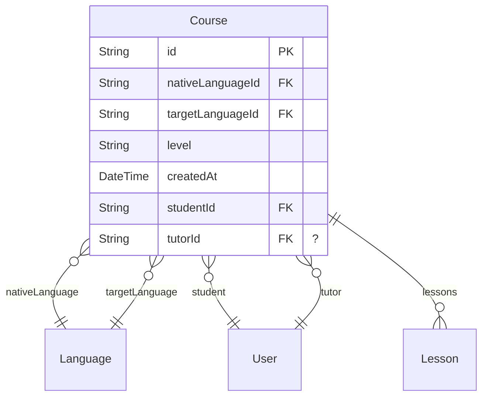
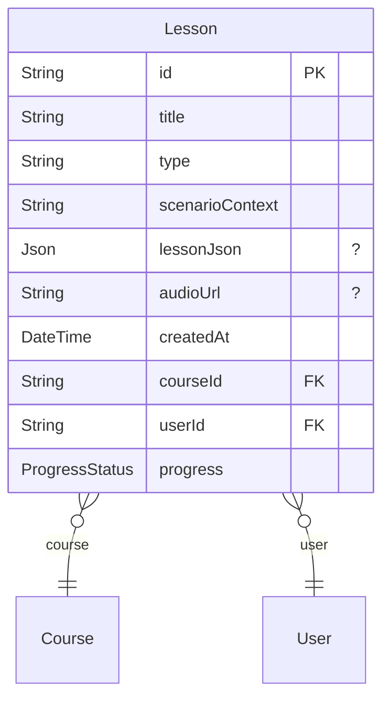
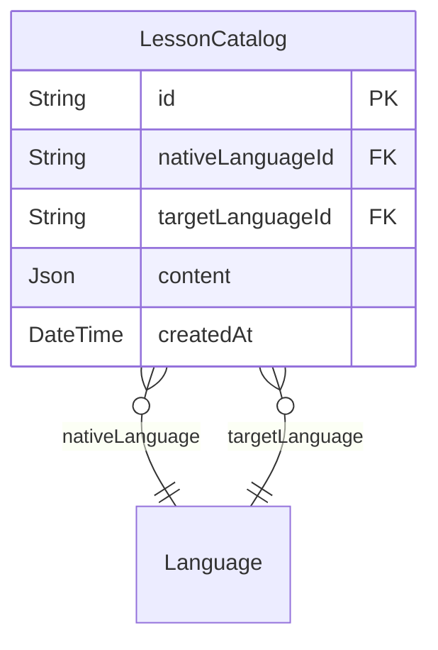

# Technical Design Document

> Generated by [`ZenStack-markdown`](https://github.com/jiashengguo/zenstack-markdown)

- [User](#User)
- [Language](#Language)
- [Course](#Course)
- [Lesson](#Lesson)
- [LessonCatalog](#LessonCatalog)

## User

- CREATE

- READ

- UPDATE

- DELETE

## Language

- CREATE

- READ
  - ✅ true
- UPDATE

- DELETE

## Course

- CREATE
  - ✅ auth() != null
- READ
  - ✅ auth() != null
- UPDATE
  - ✅ auth() != null
- DELETE
  - ✅ auth() != null
## Lesson

- CREATE

- READ

- UPDATE

- DELETE

## LessonCatalog

- CREATE

- READ

- UPDATE

- DELETE
